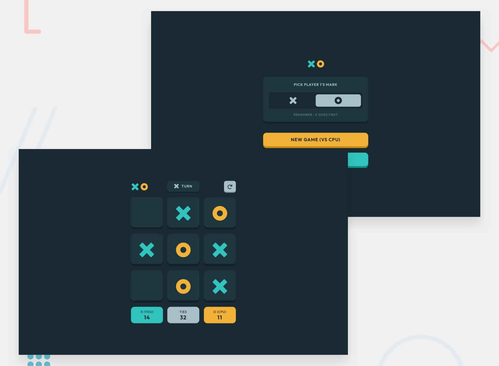
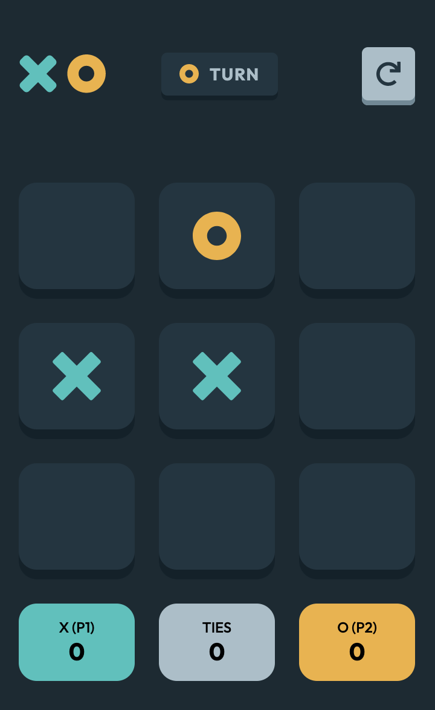
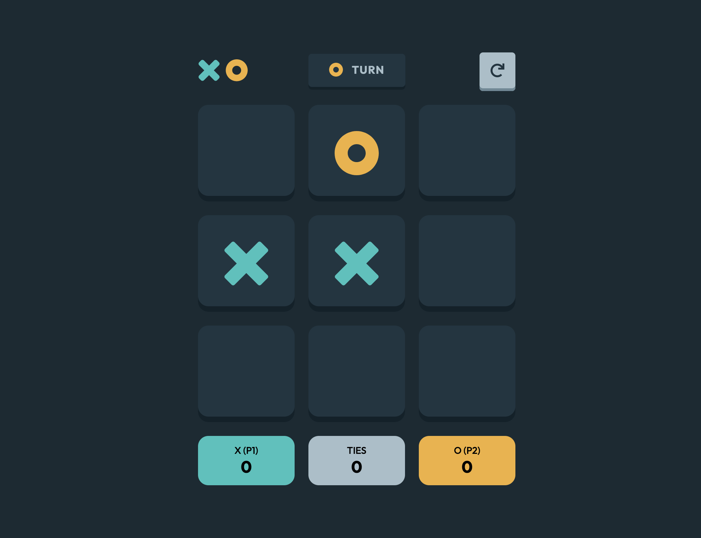

# Frontend Mentor - Tic Tac Toe solution

## Welcome! 👋

This is a solution to the [Tic Tac Toe challenge on Frontend Mentor](https://www.frontendmentor.io/challenges/tic-tac-toe-game-Re7ZF_E2v). Frontend Mentor challenges help you improve your coding skills by building realistic projects.

## Table of contents

- [Overview](#overview)
  - [The challenge](#the-challenge)
  - [Screenshot](#screenshot)
  - [Links](#links)
- [My process](#my-process)
  - [Built with](#built-with)
  - [What I learned](#what-i-learned)
  - [Continued development](#continued-development)
  - [Useful resources](#useful-resources)
- [Author](#author)

## Overview

### The challenge

A tic tac toe game where 2 players can go against each other and keep track of their wins, losses, and ties!

Users should be able to:

- View the optimal layout for the game depending on their device's screen size
- See hover states for all interactive elements on the page
- Play the game either solo vs the computer or multiplayer against another person
- **Bonus 1**: Save the game state in the browser so that it’s preserved if the player refreshes their browser
- **Bonus 2**: Instead of having the computer randomly make their moves, try making it clever so it’s proactive in blocking your moves and trying to win

### Screenshot

| Mobile (375px)                                 | Desktop (1440px)                                 |
| ---------------------------------------------- | ------------------------------------------------ |
|  |  |

### Links

- Live Site URL: [Tic Tac Toe Game](https://tic-tac-toe-8370ed.netlify.app/)

## My process

### Built with

- Semantic HTML5 markup
- Mobile-first workflow
- [React](https://reactjs.org/) - JS library
- [Styled Components](https://styled-components.com/) - For styles

### What I learned

I learned how to use styled components a bit better because I was able to do things like dynamically rendering images based on props in order to display the X and O markers.

### Continued development

- **Bonus 1**: Save the game state in the browser so that it’s preserved if the player refreshes their browser
- **Bonus 2**: Implementing a player vs CPU mode. Also, instead of having the computer randomly make their moves, try making it clever so it’s proactive in blocking your moves and trying to win.

## Author

- Website - [Personal Website](https://www.aniyaallen.com/)
- Frontend Mentor - [@amallen1](https://www.frontendmentor.io/profile/amallen1)

